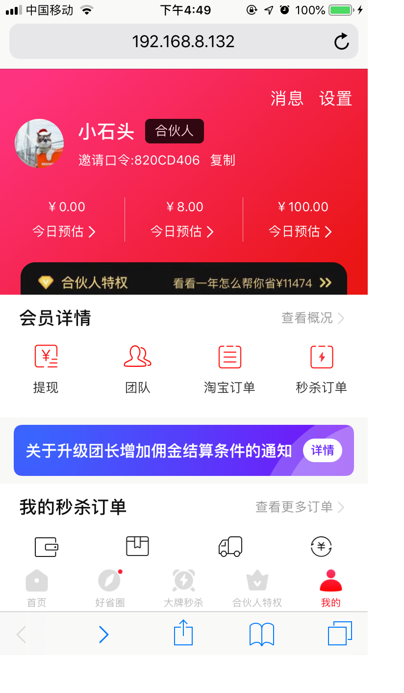
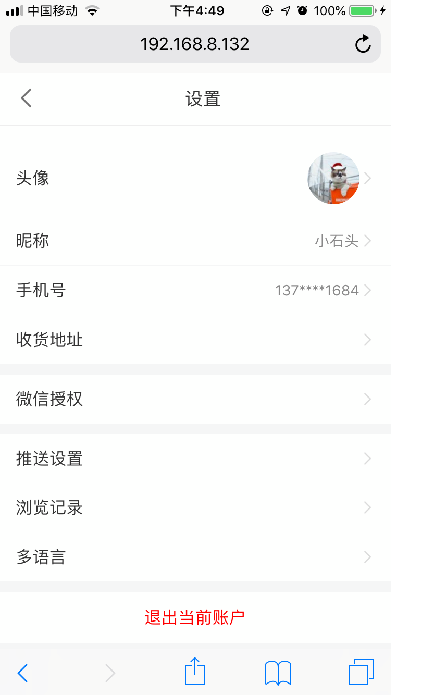
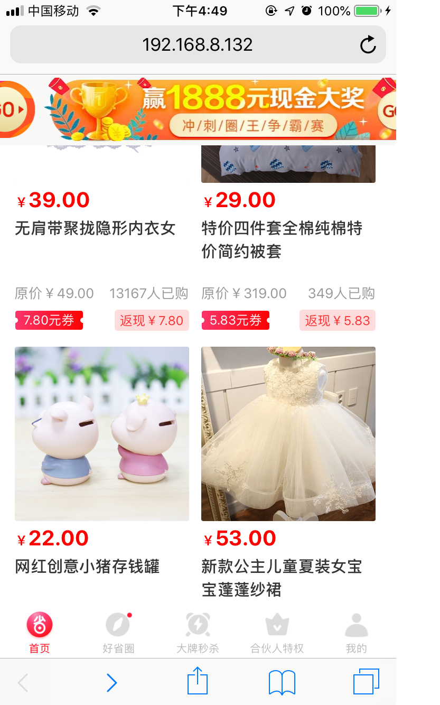
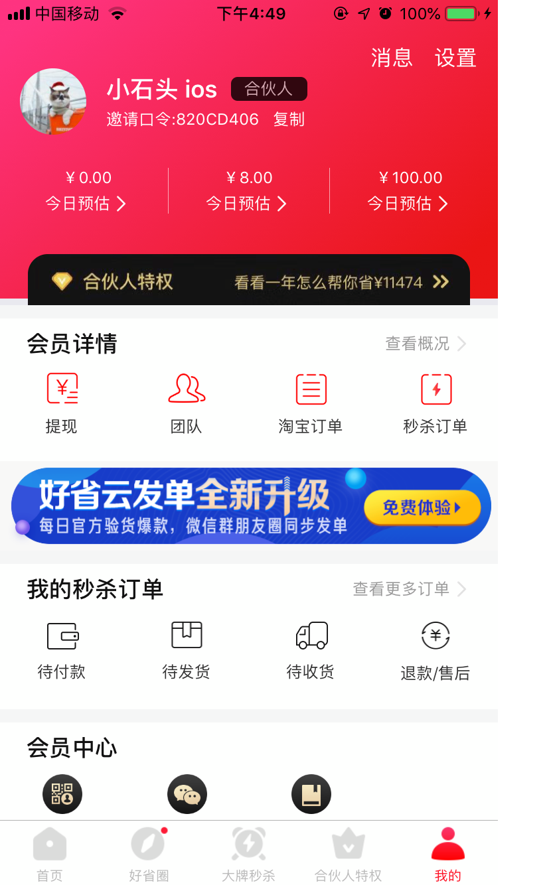
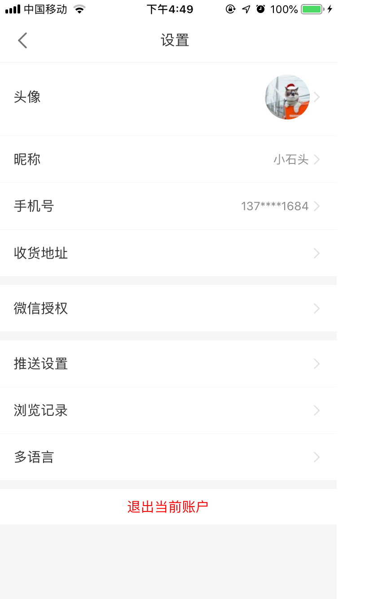
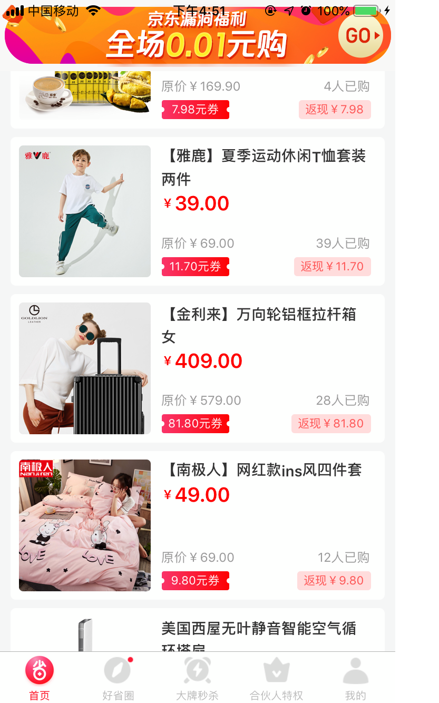
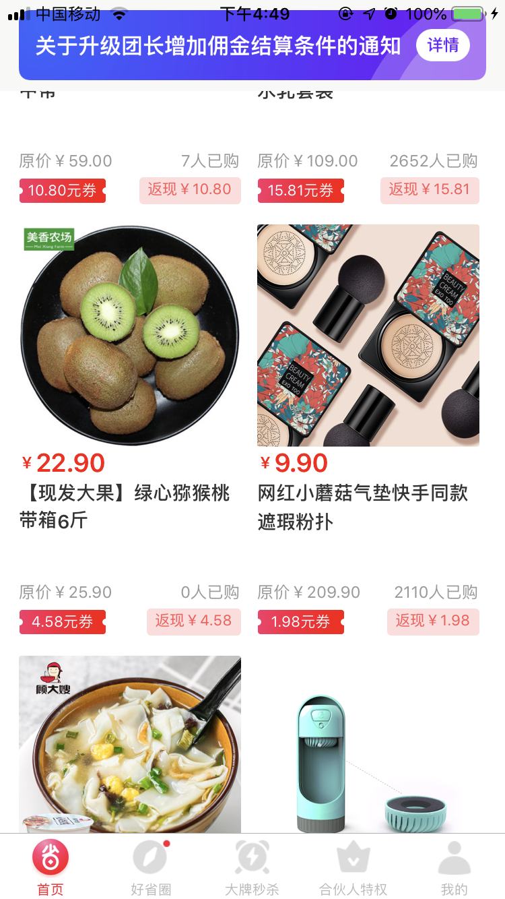
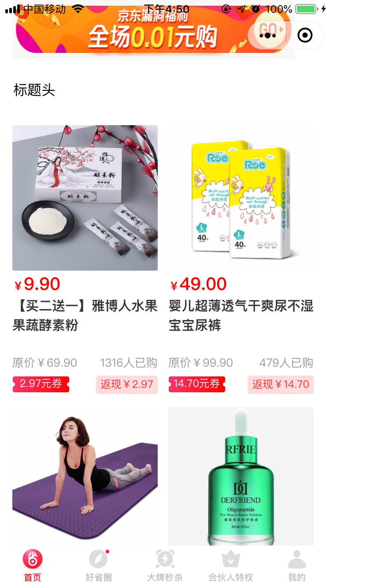

# 大淘客

## 项目运行

见官网

常见的坑

- `_reactNative.UIManager.getViewManagerConfig(reactNativeViewName)',` 报错

解决办法见 [https://github.com/expo/expo/commit/27f4c75d0b88cded2f7b109519ad70f58c0d4ad4](https://github.com/expo/expo/commit/27f4c75d0b88cded2f7b109519ad70f58c0d4ad4)

按如上提示修改 `node_modules/@unimodules/react-native-adapter/build/NativeViewManagerAdapter.js` 文件即可

RN 端需要配合 taro 提供的壳才能运行 [https://github.com/NervJS/taro-native-shell](https://github.com/NervJS/taro-native-shell)

## 适配进度

- [x] H5 -- 完美适配
- [x] React Native -- 完美适配
- [x] 微信小程序 -- 完美适配
- [x] 支付宝小程序 -- 适配中

## 目标功能

- [x] 商品列表 -- 开发中
- [x] 会员中心 -- 开发中
- [x] 设置 -- 开发中
- [ ] 商品详情 -- 开发中
- [ ] 商品搜索 -- 开发中
- [ ] 商品筛选 -- 开发中

## 部分截图展示

个人中心、设置页面、商品单双排列表

### h5 端

      

### RN 端

         

### 小程序 端

# 说明

>  如果对您有帮助，您可以点右上角 "Star" 支持一下 谢谢！ ^_^

>  如有问题请直接在 Issues 中提，或者您发现问题并有非常好的解决方案，欢迎 PR 👍

# 文档

### Taro开发文档

> https://nervjs.github.io/taro/docs/README.html

### 微信小程序官方文档

> https://mp.weixin.qq.com/debug/wxadoc/dev/

### 支付宝小程序官方文档

> https://docs.alipay.com/mini/developer/getting-started

# 技术交流

如有帮助，欢迎加好友一起共同学习

 

# License

[MIT](LICENSE)